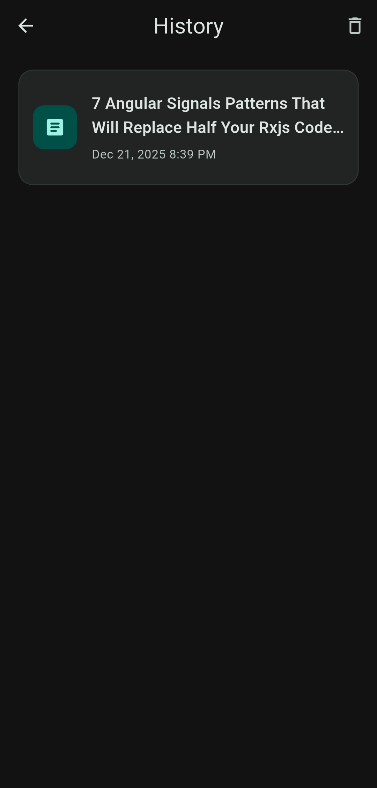

# 📖 Readora

**Readora** is a minimalist app to read Medium articles distraction-free and without paywalls.

## ✨ Features
- � **Bypass Paywalls**: Read premium articles instantly via Freedium/ReadMedium.
- 🔗 **Smart Links**: Handles all Medium domains, subdomains, and publications.
- 🧹 **Clean UI**: No ads, no clutter, just content.
- 🎨 **Customizable**: Change fonts, sizes, and switch to Dark Mode.
- 📚 **History**: Automatically saves what you've read.

## 📸 Screenshots
| Home | Reader | History | Settings |
|:---:|:---:|:---:|:---:|
|  |  |  |  |

## 🚀 Quick Start
1. **Clone & Enter**
   ```bash
   git clone https://github.com/birmehto/readora.git && cd readora
   ```
2. **Install & Run**
   ```bash
   flutter pub get && flutter run
   ```

## 🛠️ Tech
- Flutter + GetX (State Management)
- GetStorage (Local Data)
- InAppWebView (Article Rendering)

## ☕ Support
[](https://buymeacoffee.com/birmehto)

## ⚖️ Legal & Credits
- **Readora** is unofficial and not affiliated with **A Medium Corporation**.
- Uses [Freedium](https://freedium.cfd) and [ReadMedium](https://readmedium.com).
- Content belongs to original authors. MIT licensed.

---
**Happy Reading!**
