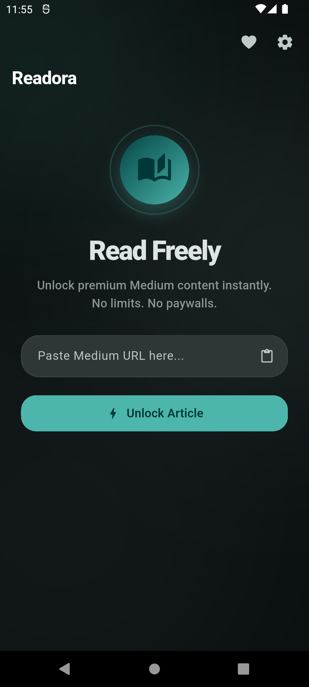
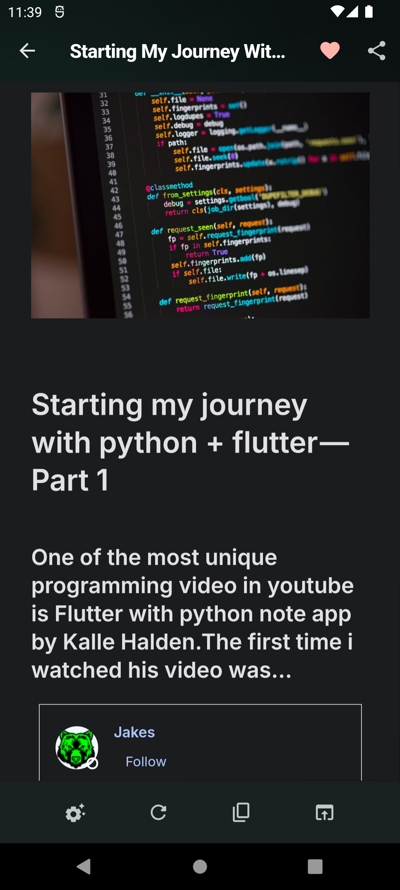
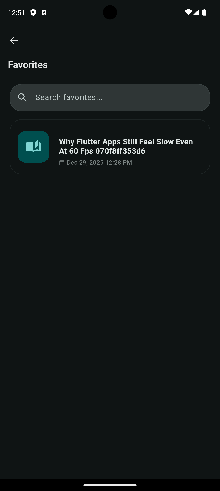
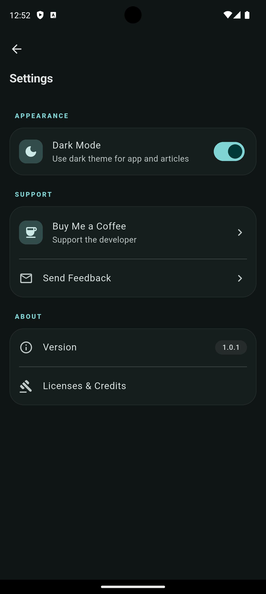

# 📖 Readora

Read Medium articles without paywalls, ads, or distractions.

## Why Readora?

- **🔓 No paywalls** — Access any Medium article freely
- **🧘 Zero clutter** — Clean reading experience with no ads or popups
- **🎨 Your style** — Customize fonts, spacing, and dark mode
- **⭐ Save favorites** — Bookmark articles you want to revisit

Works with all Medium links — publications, custom domains, everything.

## Get Started
```bash
git clone https://github.com/birmehto/readora.git
cd readora
flutter pub get
flutter run
```

## Screenshots

<p align="center">
  
  
  
  
</p>

## Support

Like Readora? [Buy me a coffee ☕](https://buymeacoffee.com/birmehto)

## Legal

Independent open-source project. Not affiliated with Medium. Exclusively uses [Freedium](https://freedium.cfd) for article access. All content © original authors. [MIT License](LICENSE).

---

**Read more. Scroll less. Stay focused.** 📚