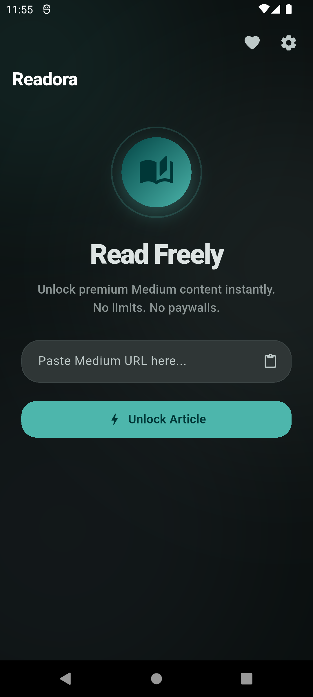
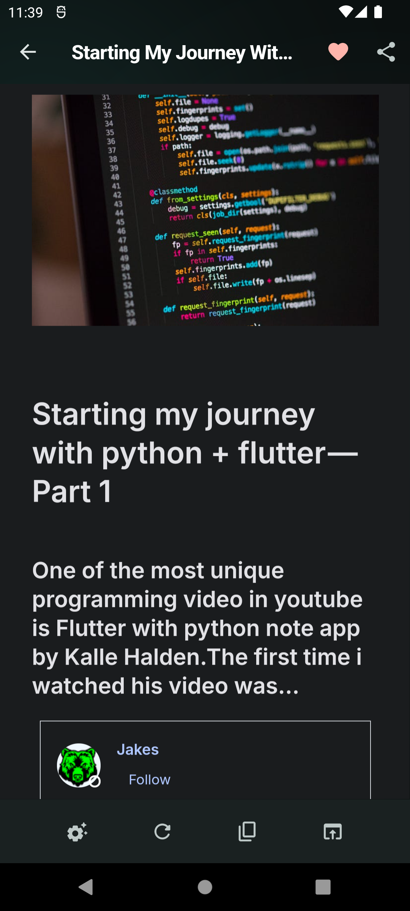
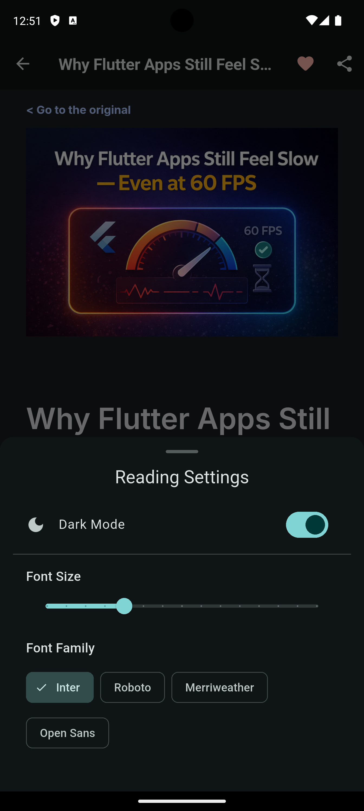
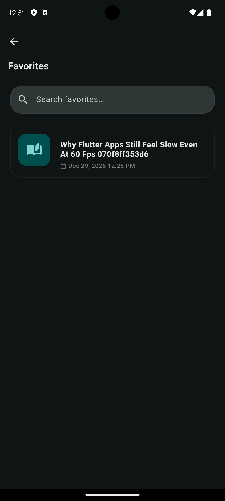

# 📖 Readora

A free, open-source Medium reader for **Android & iOS** — bypass paywalls, enjoy clean typography, and read without distractions.

<p align="center">
  
  
  
  
</p>

## Features

- 🛡️ **Failover bypass engines** — auto-switches between Freedium Mirror, Freedium CFD & ReadMedium
- 💾 **Scroll position resume** — remembers exactly where you left off
- ⭐ **Offline favorites** — save articles locally, no account needed
- 🌙 **Dark & light themes** — plus customizable fonts, sizes & spacing
- 🔗 **Share intent support** — share any Medium link and it opens directly in Readora
- 📊 **Reading progress bar** — real-time scroll indicator in the app bar

## Download

| Platform | Link |
|----------|------|
| 🤖 Android APK | [Latest Release](https://github.com/birmehto/Readora/releases/latest) |
| 🍎 iOS (unsigned IPA) | [Latest Release](https://github.com/birmehto/Readora/releases/latest) |

## Build from Source

```bash
git clone https://github.com/birmehto/readora.git
cd readora
flutter pub get
flutter run
```

## Legal

Open-source project — not affiliated with Medium. Uses public reader endpoints. All content © original authors. [MIT License](LICENSE).

## Support

Like Readora? [Buy me a coffee ☕](https://buymeacoffee.com/birmehto)